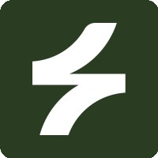
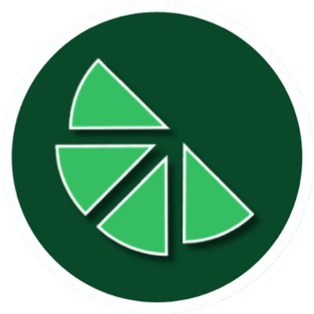

# 👋 Lourenço Ponces Duarte

  

I have a background in Computer Science & Engineering (BSc + MSc, Técnico Lisboa) and have worked in startups while also building projects on my own, often through hackathons. What I enjoy most is turning an idea into a project, creating the MVP, and shipping it.

Right now, I'm focused on applying my tech knowledge to traditional industries like construction, industrial real estate, and renewable energy. My goal is to modernize these businesses by:

- **Digitizing daily operations** and replacing outdated manual processes
- **Automating sales workflows**, client onboarding, email marketing automation, and lead generation
- **Introducing CRM systems**, AI-powered tools, and marketing automation
- **Using data dashboards** to make decisions faster and more informed

I see myself as a **solo builder** who brings practical technology into businesses that don't usually adopt it early, creating tools that directly improve efficiency and growth.

## 💼 Work Experience

<table>
  <!-- AEON -->
  <tr>
    <td width="60" align="center">
      
    </td>
    <td>
       <strong><a href="https://www.aeon.so/">AEON</a></strong> — Multi-Chain Crypto Asset Management Platform
       <em>(Feb 2025 – Jun 2025)</em>
        
       
         
         
       
    </td>
  </tr>
  <tr>
    <td></td>
    <td>
      
<b>About the Startup:</b> AEON is a platform that allows investors to manage assets across multiple blockchain ecosystems while keeping full custody. 
      It offered deep DeFi integrations and policy enforcement (e.g., transfer limits, whitelisted protocols, asset restrictions).

      
<b>My Contributions:</b>

      <ul>
        <li>Implemented a unified dashboard to display positions (lending, borrowing, staking, yield) across multiple DeFi platforms.</li>
        <li>Developed an address management system to enforce policies on which protocols accounts could interact with.</li>
        <li>Started building an action execution layer to perform DeFi operations directly from AEON without leaving the platform.</li>
        <li>Integrated with several DeFi protocols by interacting directly with their smart contracts and SDKs.</li>
      </ul>
      
      
      
      
      
      
    </td>
  </tr>

  <!-- Sonant -->
  <tr>
    <td width="60" align="center">
      
    </td>
    <td>
       <strong><a href="https://www.sonant.ai/">Sonant</a></strong> — AI Agents for the Insurance Industry
       <em>(Dec 2023 – Jan 2025)</em>
        
       
         
         
       
    </td>
  </tr>
  <tr>
    <td></td>
    <td>
      
<b>About the Startup:</b> Sonant provided AI receptionists for insurance companies, replacing large call centers with intelligent agents that could answer calls and follow structured conversation flows.

      
<b>My Contributions:</b>

      <ul>
        <li>Led agent development for the company's largest client, designing and onboarding multiple use cases.</li>
        <li>Integrated client CRM systems so call data flowed directly into their platforms.</li>
        <li>Built an internal frontend tool with ReactFlow to make it easier to design and configure agent flows.</li>
      </ul>
       
       
       
       
       
       
    </td>
  </tr>
</table>

## 🚀 Personal Projects

<table>
  <tr>
    <td width="60" align="center">
      
    </td>
    <td>
       <strong><a href="https://livestakes.fun/">Livestakes</a></strong> — ETH Global Hackathon Platform 
       
       
       <a href="https://x.com/livestakes" target="_blank"><a>
       
    </td>
  </tr>
  <tr>
    <td></td>
    <td>
      
<b>About the Project:</b> Livestakes was initially created as a platform where people could bet on hackathon teams they thought would win ETH Global events. Later, it evolved into an <b>analysis tool</b> to study hackathon projects by replaying repository histories and tracking technology adoption.

      
<b>My Contributions:</b>

        <ul>
          <li>Built a RAG system to analyze commits and extract insights from project repositories.</li>
          <li>Used LangChain to process commit data, identify implemented features, and detect sponsor tech adoption across projects.</li>
          <li>Created a support tool to test and validate the analysis system:
            <ul>
              <li>Clone repositories from database-driven configuration with parallel processing</li>
              <li>Replay commit history at accelerated speed (10x–1000x) while preserving timestamps</li>
              <li>Simulate multiple repositories in parallel with real-time progress</li>
              <li>Expose a live API server with GitHub-compatible endpoints for querying simulated repositories</li>
            </ul>
          </li>
          <li>Developed a web app dashboard to present insights to hackers and sponsors, showing detected features and technology usage clearly.</li>
        </ul>
      

        
        
        
        
        
        
      

    </td>
  </tr>
</table>

### 🏆 Notable Achievements
- 🥇 **1st Place** - HACKATHOME 2022 (Blockchain solution for urban development)
- 🥇 **1st Place** - Make IT Millennium 2023 Local Phase (ML customer churn prediction)
- 🥉 **3rd Place** - HackTogether Lisbon 2024 (Real-time collaborative platform)

**View all my hackathon achievements**: [hackathons.md](./hackathons.md)

## 📊 GitHub Analytics

  

