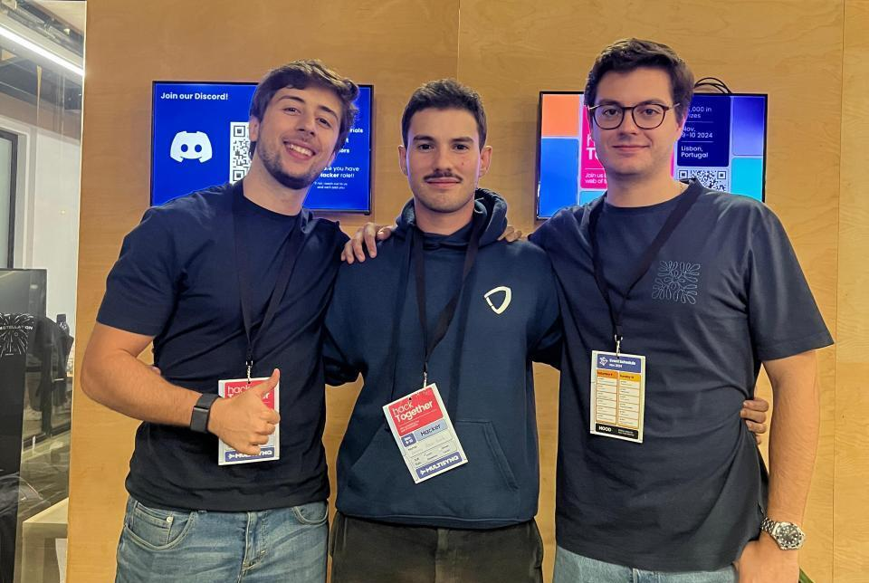
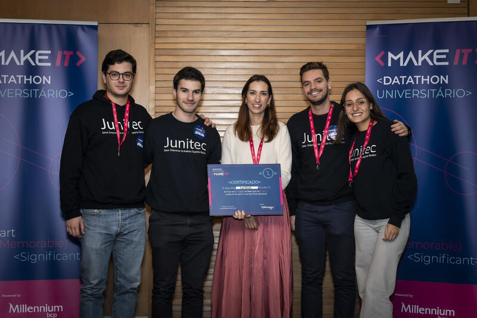
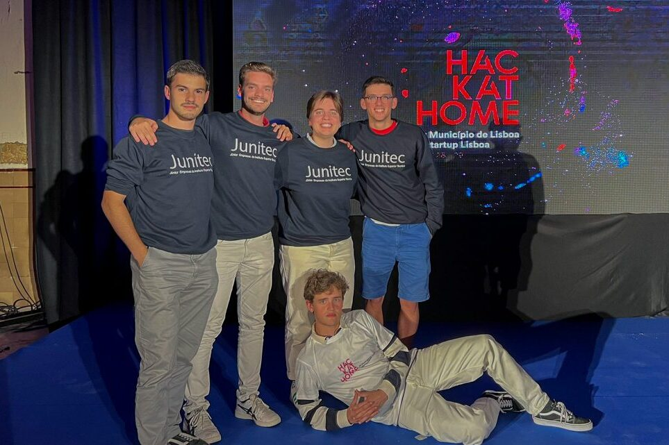
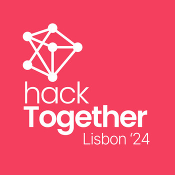
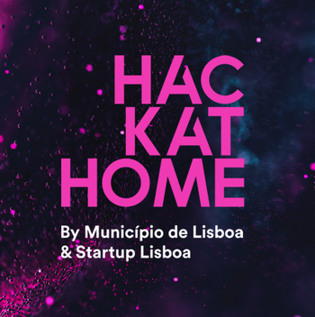

# 🏆 Hackathon Achievements

  <table style="border-collapse: collapse; border: none;">
    <tr>
      <td align="center">
         
        <b>HackTogether Lisbon 2024</b> 
        <i>3rd Place Winner</i>
      </td>
      <td align="center">
         
        <b>Make IT Millennium 2023</b> 
        <i>1st Place Local Phase</i>
      </td>
      <td align="center">
         
        <b>HACKATHOME 2022</b> 
        <i>1st Place Winner</i>
      </td>
    </tr>
  </table>

<!-- ------------------------------------------------------------- -->
<!-- ------------------------------------------------------------- -->

## 🥉 HackTogether Lisbon - 3rd Place

  <kbd>
    
  </kbd>

### 🏆 Achievement
- **3rd place** among 70 participants (21 projects, 24 hours)
- Organized by [Multisync](https://multisynq.io/) using their [ReactTogether](https://reacttogether.dev/) technology

### 🚀 Project: TripSync
TripSync transforms chaotic group trip planning into a seamless experience. Our platform simplifies the way friends coordinate their travel plans by providing an intuitive, real-time collaborative environment.

#### 📍 Key Features
- **Real-time Collaboration**
  - Synchronized trip planning with live cursors
  - Interactive maps with shared markers
  - Real-time itinerary updates

#### ⚡ Tech Stack
- **Frontend**: React, TypeScript, Google Maps API
- **Real-time**: ReactTogether (`useStateTogether`)
- **Cloud**: Cloudflare Pages

### 🔗 Resources
- 📊 [Hackathon Page](https://reacttogether.dev/hackathon)
- 🏆 [Hackathon Taikai Page](https://taikai.network/multisynq/hackathons/hacktogether)
- 🎥 [Demo Video](https://www.youtube.com/watch?v=ONnM82d7g4M)
- 🌐 [Live Demo](https://hacktogether-ariel.pages.dev/)

### 👥 Team
[Gonçalo Canhoto](https://github.com/goncalocanhoto) & [Pedro Henriques](https://github.com/PedroCarvalhoHenriques)

<!-- ------------------------------------------------------------- -->
<!-- ------------------------------------------------------------- -->

## 🥇 Make IT Millennium - 1st Place (Local Phase)

  <kbd>
    
  </kbd>

### 🏆 Achievement
- **1st place** in local phase (ULisboa)
- Advanced to the **national phase**
- Organized by [Millennium Bank](https://www.millenniumbcp.pt)

### 🚀 Project: Customer Churn Predictor
A machine learning solution that predicts and prevents customer churn through transaction data analysis.

#### 📍 Key Features
- **Predictive Analytics**
  - Customer behavior analysis
  - Transaction pattern detection
  - Risk level assessment

#### ⚡ Tech Stack
- **ML Models**: Random Forest, Gradient Boosting, KNN
- **Performance**: >70% prediction accuracy
- **Data**: Feature engineering from banking transactions

### 🔗 Resources
- 📊 [Hackathon Page](https://makeitmillennium.pt/)

### 👥 Team
[Pedro Henriques](https://github.com/PedroCarvalhoHenriques), [Pedro Rodrigues](https://github.com/Rodriguespn), [Mónica Abreu](https://www.linkedin.com/in/m%C3%B3nica-abreu/) 

<!-- ------------------------------------------------------------- -->
<!-- ------------------------------------------------------------- -->

## 🥇 HACKATHOME Hackathon - 1st Place

  <kbd>
    
  </kbd>

### 🏆 Achievement
- **1st place** winner among Lisbon's innovators
- Organized by [Startup Lisboa](https://www.startuplisboa.com/) & [CML](https://www.lisboa.pt/)
- Focused on urban development solutions

### 🚀 Project: DAOHomes
A blockchain-powered platform with the goal of revolutionizing Lisbon's housing market by connecting property owners with micro-investors.

#### 📍 Key Features
- **Smart Property Investment**
  - Tokenization of vacant properties
  - Fractional ownership system
  - Democratic renovation decisions

#### ⚡ Tech Stack
- **Blockchain**: Asset tokens, DAO governance
- **Platform**: Web application (Bubble.io MVP)
- **Design**: Figma prototypes
- **Data**: 48,000 vacant properties in Lisbon

### 💡 Impact
- Enables property owners to renovate through micro-investments
- Democratizes real estate investment (49% market interest)
- Creates sustainable urban development model

### 🔗 Resources
- 🏆 [Hackathon Page](https://www.hackathome.pt/)
- 🏆 [Hackathon Taikai Page](https://taikai.network/startuplisboa/hackathons/hackathome)
- 🎥 [Demo Video](https://www.youtube.com/watch?v=fV--UsZYCdY)
- 📰 News: [Técnico Newsletter](https://tecnico.ulisboa.pt/pt/noticias/junitec-vence-hackathome-e-cria-solucao-tecnologica-para-as-cerca-de-48-mil-casas-vazias-em-lisboa/), [ECO](https://eco.sapo.pt/2022/05/30/junikek-vence-hackathome-com-tecnologia-para-encher-casas-vazias-em-lisboa/), [The Next Big Idea](https://thenextbigidea.pt/casas-vazias-em-lisboa-o-vencedor-do-hackathome-foi-a-junikek/), [Lisbon Council (CML)](https://informacao.lisboa.pt/noticias/arquivo/detalhe/sao-conhecidos-os-vencedores-do-1o-hackathome-de-lisboa)

### 👥 Team
[Luís Parra](https://www.linkedin.com/in/luisjoseparra/), [Maria Oliveira Fernandes](https://www.linkedin.com/in/maria-oliveira-fernandes/), [Pedro Rodrigues](https://github.com/Rodriguespn), [Vicente Mendes](https://www.linkedin.com/in/vicentecondemendes/)
