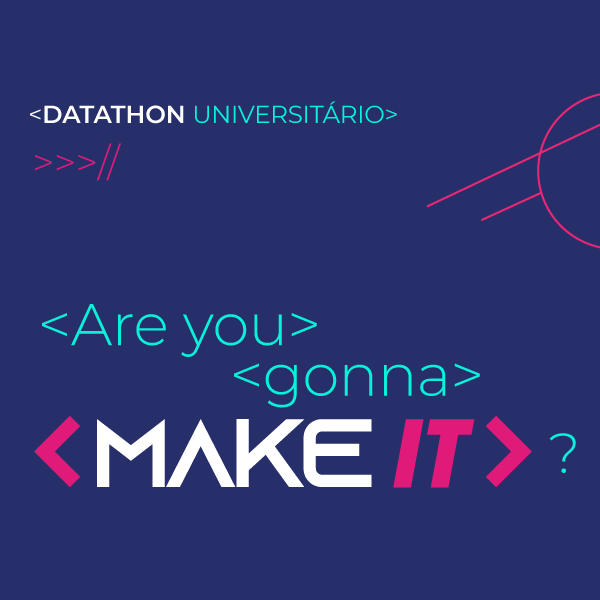

# 🏆 Hackathon Achievements

  <table style="border-collapse: collapse; border: none;">
    <tr>
      <td align="center">
         
        <b>HackTogether Lisbon 2024</b> 
        <i>3rd Place Winner</i>
      </td>
      <td align="center">
         
        <b>Make IT Millennium 2023</b> 
        <i>1st Place Local Phase</i>
      </td>
      <td align="center">
         
        <b>HACKATHOME 2022</b> 
        <i>1st Place Winner</i>
      </td>
    </tr>
  </table>

<!-- ------------------------------------------------------------- -->
<!-- ------------------------------------------------------------- -->

## 🥉 HackTogether Lisbon - 3rd Place

  <kbd>
    
  </kbd>

**November 2024** |  | [Event Link](https://reacttogether.dev/hackathon)

### 🏆 Achievement
- Secured **3rd place** among 70 participants who created 21 projects over 24 hours
- Organized by Multisync, focusing on real-time collaboration technologies
- Developed and presented the project within an intense 24-hour timeframe

### 🚀 Project: TripSync
TripSync transforms chaotic group trip planning into a seamless experience. Our platform simplifies the way friends coordinate their travel plans by providing an intuitive, real-time collaborative environment.

#### ✨ Key Features
- 📍 **Interactive Shared Itineraries**
  - Collaborative trip planning in real-time
  - Dynamic timeline visualization
  - Instant updates across all participants
- 🗺️ **Smart Map Integration**
  - Interactive destination exploration
  - Point of interest management
  - Real-time location sharing
- ⚡ **Real-time Collaboration**
  - Synchronized editing for all users
  - Live updates across devices
  - Seamless multi-user experience

### 💻 Tech Stack
- **React Together** - Multisync's real-time synchronization library
  - Implemented `useStateTogether` hook for state synchronization
  - Real-time data consistency across clients
  - Seamless multi-user collaboration
- **Google Maps API**
  - Interactive map integration
  - Dynamic POI management
  - Custom markers and routing
- **React & TypeScript**
  - Modern component architecture
  - Type-safe development
  - Responsive design

### 🔗 Project Links
- [🎥 Demo Video](https://www.youtube.com/watch?v=ONnM82d7g4M)
- [🌐 Live Project](https://hacktogether-ariel.pages.dev/)

### 👥 Team
- [Gonçalo Canhoto](https://github.com/goncalocanhoto)
- [Pedro Henriques](https://github.com/PedroCarvalhoHenriques)

<!-- ------------------------------------------------------------- -->
<!-- ------------------------------------------------------------- -->

## 🥇 Make IT Millennium - 1st Place (Local Phase)

  <kbd>
    
  </kbd>

**February 2023** |  | [Event Link](https://www.millenniumbcp.pt)

### 🏆 Achievement
- Won **1st place** in the local phase (ULisboa)
- Advanced to the **national phase**

### 🎯 Project: Customer Churn Prediction
Developed a sophisticated predictive model for banking customer retention:

#### 📊 Technical Highlights
- **Machine Learning Models**:
  - Random Forest
  - Gradient Boosting
  - K-Nearest Neighbors (KNN)
- **Accuracy**: >70%
- **Business Impact**: Actionable churn prevention strategies

<!-- ------------------------------------------------------------- -->
<!-- ------------------------------------------------------------- -->

  <kbd>
    
  </kbd>

## 🥇 HACKATHOME Hackathon - 1st Place
**May 2022** |  | [Event Link](https://hackathome.pt)

### 🏆 Achievement
- Won **1st place** at HACKATHOME Hackathon
- Organized by Startup Lisboa and Câmara Municipal de Lisboa

### 🏠 Project: Lisbon Property Revitalization
A platform addressing Lisbon's housing challenges:

#### 💡 Key Features
- Connects 48,000 empty houses with investors
- Innovative renovation funding model
- Profit-sharing system for property investments

### 👥 Jury Presentation
Presented to distinguished panel including:
- Câmara Municipal de Lisboa
- Startup Lisboa
- Microsoft
- Instituto Superior Técnico
